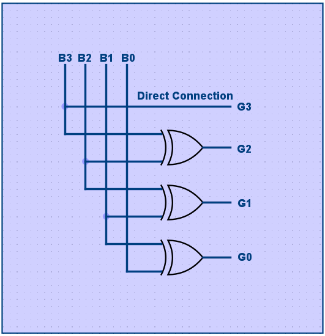
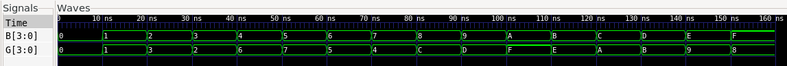

# Binary to Gray code converter

## What is Binary to Gray and How to convert Binary to Gray ?
A `binary-to-gray` Code converter is a combinational Logic circuit thats convert a binary number into its equivelent gray code.
#### For a 4bit converter:
+ Input 4bit binary numbers
  + Example`B[3:0]`
+ Output 4bit gray code
  + Example `G[3:0]`

## Binary to Gray Conversion Rule
#### For a 4bit Binary-to-Gray:
Binary: `B3 B2 B1 B0`
Gray: `G3 G2 G1 G0`

#### The gray code is genereted using XOR Oparation:
`G3 = B3;`  
`G2 = B3 ^ B2;`  
`G1 = B2 ^ B1;`  
`G0 = B1 ^ B0;`

Therefore,
`G = B ^ (B >> 1);`

`^ `Thats Represents XOR (Exclusive-OR)
## Implemention
The converter can be implemented using XOR Gates.
#### Logic Diagram:
   Figure: 1.1

#### Thus, the circuit requirments:
* 3x XOR Gates
* 1x Direct Connection

### Verilog Implemention:
```verilog
module BinarytoGray(
    input [3:0] B,
    output [3:0] G
);

assign G[3] = B[3];
assign G[2] = B[3] ^ B[2];
assign G[1] = B[2] ^ B[1];
assign G[0] = B[1] ^ B[0];

endmodule
```
[Verilog File ->](../Main/BG.v)
### Compact Implemention:
#### The same circuit can also be written using the Binary to gray equation:

```verilog
module BinarytoGray(
    input wire [3:0] B,
    output wire [3:0] G
); 

assign G = B ^ (B >> 1);

endmodule 
```

Both implemention produce same result.

## Example
Binary = 1010

`G3 = B3` (1) Direct Connection 1 = 1  
`G2 = B3 ^ B2` 1 ^ 0 = (1)  
`G1 = B2 ^ B1` 0 ^ 1 = (1)  
`G0 = B1 ^ B0` 1 ^ 0 = (1)


#### Therefore,  
Binary = 1010  
Gray = 1111  

## Verification
The design can be verified using verilog testbench.

The testbench applies different 4bit binary inputs and checks whether the genereted gray code is correct.

#### Example:

| binary | Gray | Decimal |
|:------:|:----:|:-------:|
|0000    | 0000 | 0
|0001    | 0001 | 1
|0010    | 0011 | 2
|0011    | 0010 | 3
|0100    | 0110 | 4
|0101    | 0111 | 5
|0110    | 0101 | 6
|0111    | 0100 | 7
|1000    | 1100 | 8
|1001    | 1101 | 9
|1010    | 1111 | 10

The complete 4-bit truth table can be used to verifed all 16 possible input combinations.

#### Simulation with waveform:

## Used Tools
- Verilog hdl
- Icarus verilog
- GTKWave
- VS code
- Linux/WSL


## Used Commands:
#### Use this command for Compile the code -
```cd
iverilog -g2012 -o testBG BG.v BG_tb.v 
```
#### This command use for simulation -
```cd
vvp testBG
```
#### This one use for simulation with waveform -
```cd
gtkwave BG.vcd
```
## Links
[Reddit](https://www.reddit.com/user/Badsha-Recognition28/?utm_source=share&utm_medium=web3x&utm_name=web3xcss&utm_term=1&utm_content=share_button)  | [GitHub](https://github.com/Badshas-lab) | [Download Report PDF 
📥](../Documents/BinaryToGray%20code%20converter%20report.pdf)

Made by `@Badsha` 2026 (F1 block project)