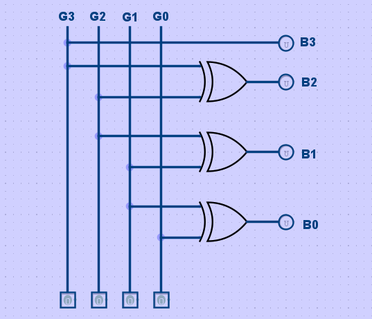

# Gray to Binary code converter
## What is a Gray to Binary code coonverter and how its works?
A `Gray-to-binary` code converter is a combintional logic circuit that convert gray code into its equivelent binary number. And its using `XOR` gates for convert gray code into binary number.

#### For a 4-bit Converter:
- Input `Gray[3:0]`
- Output `Binary[3:0]`
  
## Gray to Binary Conversion Rules
#### For a 4-bit Converter:
- Gray  `G = G3 G2 G1 G0`   
- Binary `B = B3 B2 B1 B0`

#### The binary code is genereted using `XOR` oparation:
`B3 = G3`  
`B2 = G3 ^ G2`  
`B1 = G2 ^ G1`  
`B0 = G1 ^ G0`

Therefore,   
`B = G ^ (G >> 1)`

## Implemention
The converter can be implemented using `XOR` gates.  



#### Thus, the circuit requirments:
* 3x XOR Gates
* 1x Direct Connection

### Verilog Implemention:
```verilog
module BinarytoGray(
    input [3:0] G,
    output [3:0] B
);

assign B[3] = G[3];
assign B[2] = G[3] ^ G[2];
assign B[1] = G[2] ^ G[1];
assign B[0] = G[1] ^ G[0];

endmodule
```

[Verilog File ->](../Main/GB.v)
### Compact Implemention:
#### The same circuit can also be written using the Binary to gray equation:

```verilog
module BinarytoGray(
    input wire [3:0] G,
    output wire [3:0] B
); 

assign B = G ^ (G >> 1);

endmodule 
```

Both implemention produces same outputs.
### Example
Gray = 0110     

`B3 = G3` (0) Direct Connection   
`B2 = G3 ^ G2` (1) 0 ^ 1 = 1   
`B1 = G2 ^ G1` (0) 1 ^ 1 = 0   
`B0 = G1 ^ G0` (1) 0 ^ 1 = 1

#### Therefore,   
Gray = 0110   
Binary = 0101

## Verification
The design can be verified using verilog testbench.

The testbench applies different 4-bit Gray inputs and checks whether the genereted binary code is correct.

#### Example:

| binary | Gray | Decimal |
|:------:|:----:|:-------:|
|0000    | 0000 | 0
|0001    | 0001 | 1
|0010    | 0011 | 2
|0011    | 0010 | 3
|0100    | 0110 | 4
|0101    | 0111 | 5
|0110    | 0101 | 6
|0111    | 0100 | 7
|1000    | 1100 | 8
|1001    | 1101 | 9
|1010    | 1111 | 10

The complete 4-bit truth table can be used to verifed all 16 possible input combinations.

#### Simulation with waveform:


## Used Tools
- Verilog hdl
- Icarus verilog
- GTKWave
- VS code
- Linux/WSL


## Used Commands:
#### Use this command for Compile the code -
```cd
iverilog -g2012 -o testGB GB.v GB_tb.v 
```
#### This command use for simulation -
```cd
vvp testGB
```
#### This one use for simulation with waveform -
```cd
gtkwave GB.vcd
```
## Links
[Reddit](https://www.reddit.com/user/Badsha-Recognition28/?utm_source=share&utm_medium=web3x&utm_name=web3xcss&utm_term=1&utm_content=share_button)  | [GitHub](https://github.com/Badshas-lab) | [Download Report PDF 
📥](../document/GraytoBinary.pdf)

Made by `@Badsha` 2026 (F1 block project)