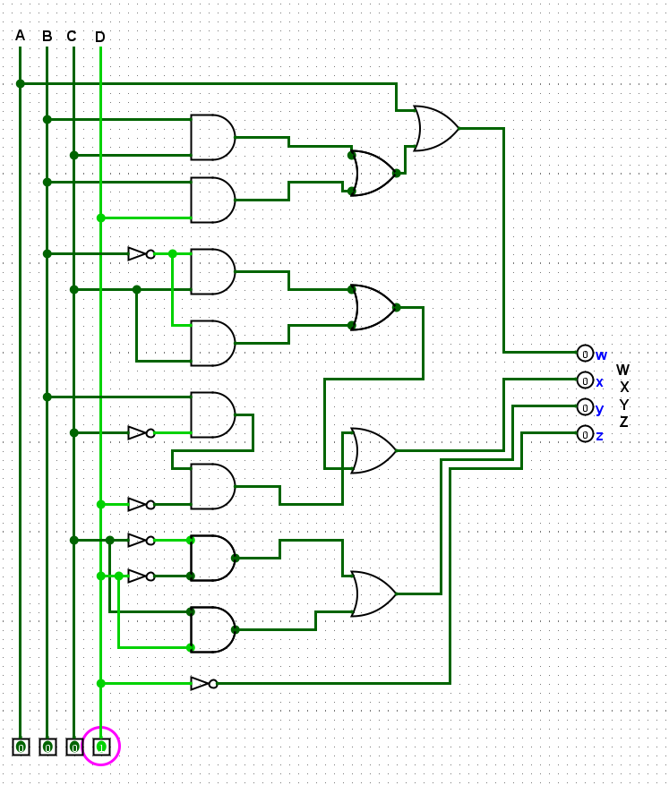
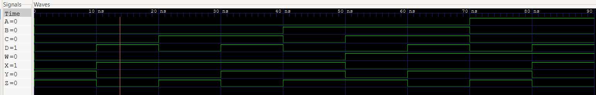

# BCD to Excess-3 Code Converter Report 2026

## What is a `BCD to Excess-3`   and how it works ?

A `BCD to Excess-3` is code converter and that is a combinational logic circuit that converts `BCD` into a `Excess-3` code.

### For 4b-Bit Converter :
- Inputs `A, B, C, D`
- Outputs `W, X, Y, Z`

## BCD to Excess-3(XS-3) Conversion Rules
For 4-Bit BCD to Excess-3 Code Converter Using Multiple Logic Gates Such As :
- AND 
  - Exmaple `(A & B)`
- OR
  - Example `(A | B)`
- NOT
  - Example `(~A)`

## Implemention
The BCD to Excess-3 Code Converter Can Be Implemented Using (AND,OR,NOT) Logic Gates.



#### Thus, The circuit requirment :
- 8x AND Gates
- 6x NOT Gates
- 5x OR Gates
- Multiple wires
  
#### Verilog Implemention :
```verilog
module BCDtoXS3(
    input A,B,C,D,
    output W, X, Y, Z
);

assign W = A | (B & C) | (B & D);
assign X = (~B & C) | (~B & D) | (B & ~C & ~D);
assign Y = (~C & ~D) | (C & D);
assign Z = ~D;

endmodule
```

## Example
Add binary 0011 = 3 with BCD code to produces Excess-3 code.

| BCD | Add 3 |Excess-3 Result|
|:---:|:---:|:---:|
|ABCD |     |WXYZc|
|0001 | 0011| 0100|
|0010 | 0011| 0101|
|0101 | 0011| 1000|
|1001 | 0011| 1100|

Therefore,
If `BCD = 0101`, The result is `Excess-3 = 1000`

## Verification
The design can be verified using verilog testbench.

The testbench applies 4-bit different BCD inputs and checks whether the genereted Excess-3 code is correct.

#### Example :
BCD to Excess-3 Truth Table
| BCD | Add 3 |Excess-3 Result|
|:---:|:---:|:---:|
|ABCD |     |WXYZc|
|0000 | 0011| 0011|
|0001 | 0011| 0100|
|0010 | 0011| 0101|
|0011 | 0011| 0110|
|0100 | 0011| 0111|
|0101 | 0011| 1000|
|0110 | 0011| 1001|
|0111 | 0011| 1010|
|1000 | 0011| 1011|

Use this truth table to verified BCD to Excess-3 code converter successfully.

#### Used TestBench Example
```verilog
`timescale 1ns/1ps
module BCDtoXS3_tb;
    reg A;
    reg B;
    reg C;
    reg D;
    wire W;
    wire X;
    wire Y;
    wire Z;

BCDtoXS3 UnitUnderTest(
    .A(A),
    .B(B),
    .C(C),
    .D(D),
    .W(W),
    .X(X),
    .Y(Y),
    .Z(Z)
);

initial begin
    $dumpfile("BCDtoXS3");
    $dumpvars(0, BCDtoXS3_tb);
    $monitor("time=%0t | A=%b B=%b C=%b D=%b | W=%b X=%b Y=%b Z=%b", $time, A,B,C,D,W,X,Y,Z);

    A = 0; B = 0; C = 0; D = 0; #10;
    A = 0; B = 0; C = 0; D = 1; #10;
    A = 0; B = 0; C = 1; D = 0; #10;
    A = 0; B = 0; C = 1; D = 1; #10;
    A = 0; B = 1; C = 0; D = 0; #10;
    A = 0; B = 1; C = 1; D = 0; #10;
    A = 0; B = 1; C = 1; D = 1; #10;
    A = 1; B = 0; C = 0; D = 0; #10;
    A = 1; B = 0; C = 0; D = 1; #10;
    

    $stop;
end
endmodule
```
## Simulation with Waveform
For Waveform using GTKWave that is waveform tool.



## Used tools and Softwares :
- Verilog hdl
- Icarus verilog
- GTKWave
- VS code
- Linux/WSL
  
## Used Commands :

For compile use this command
```
iverilog -g2012 -o testBCDtoXS3 BCDtoExcess3.v BCDtoExcess3_tb.v
```

For simulation use this command
```
vvp testBCDtoXS3
```

For waveform use this command
```
gtkwave BCDtoXS3.vcd
```

## Links

[Reddit](https://www.reddit.com/user/Badsha-Recognition28/?utm_source=share&utm_medium=web3x&utm_name=web3xcss&utm_term=1&utm_content=share_button) | [Github](https://github.com/Badshas-lab)

Made 2026