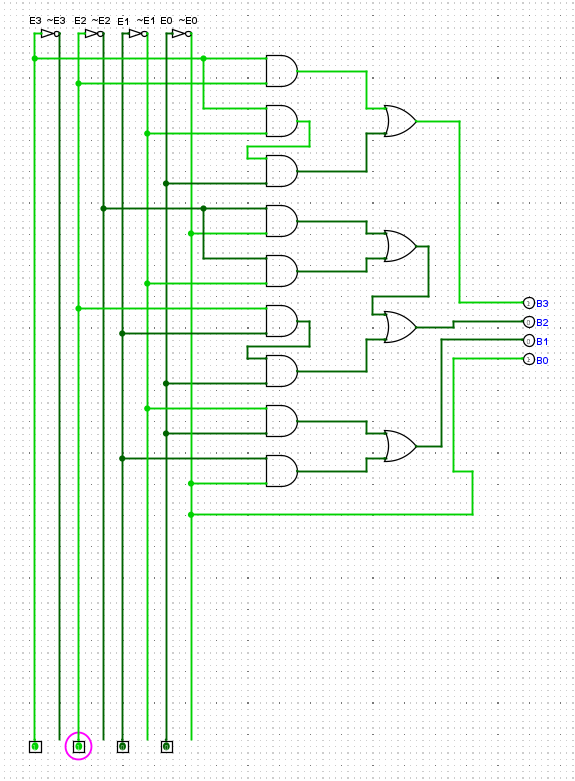
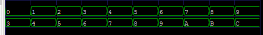

# Excess-3 to BCD Full Report
## What is an Excess-3 to BCD?
An `Excess-3 to BCD` is a code converter and combinational logic circuit, that inputs 4-bit Excess-3 code into produces BCD.

#### For a 4-bit converter
- Inputs `[3:0] E`
- Outputs `[3:0] B`

## Implement
The BCD code genereted using multiple logic gates.



Thus, The circuit requirments :
- 4x Parallal NOT Gate
- 9x AND Gates
- 4x OR Gates
- Multiple wires

#### Verilog Implemtion :
```verilog
module XS3toBCD(
 input [3:0] E,
 output [3:0] B
);

assign B[3] = (E[3] & E[2]) |
              (E[3] & E[1] & E[0]);
assign B[2] = (~E[2] & ~E[0]) |
              (~E[2] & ~E[1]) |
              (E[2] & E[1] & E[0]);
assign B[1] = (~E[1] & E[0]) |
              (E[1] & ~E[0]);
assign B[0] = ~E[0];

endmodule
```

## Verification
The design verified can be using verilog icarus.

The testbench applies 4-bit different Excess-3(XS-3) inputs and checks whether the genereted BCD code is correct.

Truth table here :
|Excess-3|BCD   | Decimal |
|:------:|:----:|:-------:|
|0011    | 0000 | 0 |
|0100   | 0001  | 1 |
|0101    | 0010 | 2 |
|0110   | 0011  |3 |
|0111    | 0100 | 4 |
|1000   | 0101  |5 |
|1001   | 0110  |6 |
|1010    | 0111 | 7 |
|1011   | 1000  |8 |
|1100   | 1001  |9 |

Excess-3 starts from 0011 and 1100 is end so if 
- 0010
- 0001
- 1101
- 1110
- 1111

These are not valid for `Excess-3 to BCD` code converter. But these can be using as a `Don't Care` for make group large, Don't Care notetion such as `X`.

#### Simulation with WaveForm
For simulation using gtkwave to simulate that circuit.


## Used Tools
- Verilog Icarus
- Verilog HDL
- VS code
- Linux/WSL
- GTKWave

## Used Commands
For compile the hdl using this command:
```
iverilog -g2012 -o testXS3toBCD XS3toBCD.v XS3toBCD_tb.v
```

For simulate use this command:
```
vvp testXS3toBCD
```

For simulation with waveform use this command:
```
gtkwave XS3toBCD.vcd
```
## Links
[Reddit](https://www.reddit.com/user/Badsha-Recognition28/?utm_source=share&utm_medium=web3x&utm_name=web3xcss&utm_term=1&utm_content=share_button)  |  [GitHub](https://github.com/Badshas-lab)

Made by `@Badsha` 2026 (F1 block project)